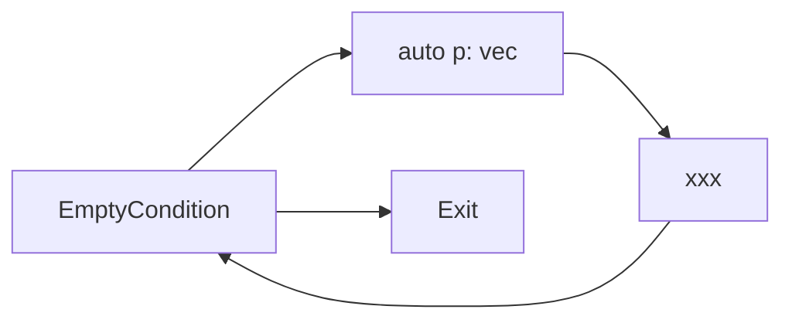
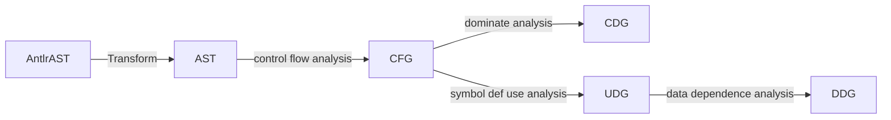

# About CppCodeAnalyzer

It is a parsing tool based on python for C/C++ to construct code property graph, which is the python version of [CppCodeAnalyzerJava](https://github.com/for-just-we/CppCodeAnalyzerJava), most of functions of CppCodeAnalyzer are similar to Joern, the differences are that:

- The grammar we utilize here is from the repo of [grammars-v4](https://github.com/antlr/grammars-v4) Antlr official, which means the input of module ast (Antlr AST) is quite different from Joern, but the output customized AST is the same, so the parsing module in ast package is different from Joern.

- When constructing CFG, CppCodeAnalyzer takes `for-range` and `try-catch` into consideration.

    * when parsing code such as `for (auto p: vec){ xxx }`, the CFG is like in graph 1
    
    * when parsing `try-catch`, we simple ignore statements in catch block because in normal states they are not going to be executed, and the control flow in `try-catch` is quite hard to compute.
    
    * when parsing use-def information by udg package, we take the information of pointer uses. For example, `memcpy(dest, src, 100);` defines symbol `* dest` and uses symbol `* src`, Joern considered pointer define with variable `Tainted` but did not consider pointer uses.

Graph 1    


The pipeline of CppCodeAnalyzer is similar to Joern, which could be illustrated as:



If you want more details, coule refer to [Joern工具工作流程分析](https://blog.csdn.net/qq_44370676/article/details/125089161)

- package ast transform Antlr AST to customized AST.

- package cfg conduct control flow analysis and convert customized AST into CFG.

- package cdg conduct statement dominate analysis and construct control dependence relations between statements.

- package udg analyze the symbols defined and used in each statement independently.

- package ddg construct data dependence relations between statements with def-use information computed in udg package.
  
  
# Usage

The testfile in directionary `test/mainToolTests` illustrated the progress of each module, you could refer to those test cases to learn how to use API in CppCodeAnalyzer.

Environment:

- python 3.8

- antlr4-python3-runtime 4.9.2

Used as python package:

- Download release first and unzip

- Run `python setup.py bdist_wheel` and `pip install dist/CppCodeAnalyzer-1.0-py3-none-any.whl`

- After installing, when import APIs from CppCodeAnalyzer, you just need to add prefix `CppCodeAnalyzer` to the package name, for example, the import statement `from mainTool.udg.astAnalyzers import ASTDefUseAnalyzer, CalleeInfos, CFGToUDGConverter` in [CPGBuildTest.py](https://github.com/for-just-we/CppCodeAnalyzer/blob/master/test/mainToolTests/CPGBuildTest.py), you just need to modify to `from CppCodeAnalyzer.mainTool.udg.astAnalyzers import ASTDefUseAnalyzer, CalleeInfos, CFGToUDGConverter`.


# Our motivations

- When we conduct experiments with Joern tool parsing SARD datasets, we find some error.The statement `wchar_t data[50] = L'A';` should be in a single CFG node, but each token in the statement is assigned to a CFG node, after we check the source code, we believe the root cause is the grammar used by [Joern](https://github.com/octopus-platform/joern/blob/dev/projects/extensions/joern-fuzzyc/src/main/java/antlr/Function.g4#L13).  

- Also, most researches utilize python to write deep-learning programs, it could be more convenient to parse code with python because the parsing module could directly connect to deep-learning module, there would be no need to write scripts to parse output of Joern.

# Challenges

- Parsing control-flow in `for-range` and `try-catch` is difficult, there are no materials depicting CFG in `for-range` and `try-catch`.

- Parsing def-use information of pointer variable is difficult. For example, in `*(p+i+1) = a[i][j];`, symbols defined include `* p` and used include `p, i, j, a, * a`. However, this is not very accurate, but computing the location of memory staticlly is difficult. This could brings following problems.

```cpp
s1: memset(source, 100, 'A');
s2: source[99] = '\0';
s3: memcpy(data, source, 100);
```

- In results of CppCodeAnalyzer, s1 and s2 define symbol `* source` , but the later kills the front. So, there is only DDG edge `s2 -> s3` in DDG.

- However, s1 defines `* source`, s2 defines `* ( source + 99)`, a precise DDG should contains edge `s1 -> s3, s2 -> s3`

Also, our tool is much more slower than Joern, normally parsing a file in SARD dataset needs 20 - 30 seconds, so we recommand dump output CPG into json format first if you need to train a model. The Java version [CppCodeAnalyzerJava](https://github.com/for-just-we/CppCodeAnalyzerJava) is much more faster, if you prefer fast analysis you could use Java version.


# configuration

[CalleeInfos.json](https://github.com/for-just-we/CppCodeAnalyzer/blob/master/resources/calleeInfos.json) stores APIs which define or use variable of pointer type, you can use `json` package to load these callee infos and set [ASTDefUseAnalyzer](https://github.com/for-just-we/CppCodeAnalyzer/blob/master/mainTool/udg/astAnalyzers.py).calleeInfos according to your own preference when analysing use-def information of each code line.


# Extra Tools

The package `extraTools` contains some preprocess code for vulnerability detectors IVDetect, SySeVR and DeepWuKong. The usage could refer to file in `test/extraToolTests`


# References


> [Yamaguchi, F. , Golde, N. , Arp, D. , & Rieck, K. . (2014). Modeling and Discovering Vulnerabilities with Code Property Graphs. IEEE Symposium on Security and Privacy. IEEE.](https://ieeexplore.ieee.org/document/6956589)

> [Li Y , Wang S , Nguyen T N . Vulnerability Detection with Fine-grained Interpretations. 2021.](https://arxiv.org/abs/2106.10478)

> [SySeVR: A Framework for Using Deep Learning to Detect Software Vulnerabilities\[J\]. IEEE Transactions on Dependable and Secure Computing, 2021, PP(99):1-1.](https://arxiv.org/abs/1807.06756)

> [Cheng X , Wang H , Hua J , et al. DeepWukong[J]. ACM Transactions on Software Engineering and Methodology (TOSEM), 2021.](https://dl.acm.org/doi/10.1145/3436877)
